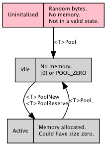

# Pool\.h #

## Parameterised Stable Pool ##

 * [Description](#user-content-preamble)
 * [Typedef Aliases](#user-content-typedef): [&lt;PT&gt;ToString](#user-content-typedef-c92c3b0f), [&lt;PT&gt;Action](#user-content-typedef-33725a81)
 * [Struct, Union, and Enum Definitions](#user-content-tag): [&lt;T&gt;Pool](#user-content-tag-517215cf)
 * [Function Summary](#user-content-summary)
 * [Function Definitions](#user-content-fn)
 * [License](#user-content-license)

## <a id = "user-content-preamble" name = "user-content-preamble">Description</a> ##

[&lt;T&gt;Pool](#user-content-tag-517215cf) stores unordered `<T>` in a memory pool, which must be set using `POOL_TYPE`\. Pointers to valid items in the pool are stable, and as such, contiguity is not possible\. However, it uses geometrically increasing size\-blocks and when the removal is ongoing and uniformly sampled, \(specifically, old elements are all removed,\) and data reaches a steady\-state size, the data will eventually be in one allocated region\. In this way, provides a fairly contiguous space for items to which there might have permanent references or hierarchical structures with different sizes\.

`<T>Pool` is not synchronised\. Errors are returned with `errno`\. The parameters are preprocessor macros, and are all undefined at the end of the file for convenience\. `assert.h` is included in this file; to stop the debug assertions, use `#define NDEBUG` before `assert.h`\.

 * Parameter: POOL\_NAME, POOL\_TYPE  
   `<T>` that satisfies `C` naming conventions when mangled and a valid tag \(type\) associated therewith; required\. `<PT>` is private, whose names are prefixed in a manner to avoid collisions; any should be re\-defined prior to use elsewhere\.
 * Parameter: POOL\_TO\_STRING  
   Optional print function implementing [&lt;PT&gt;ToString](#user-content-typedef-c92c3b0f); makes available [&lt;T&gt;PoolToString](#user-content-fn-a0df87e3)\. Usually this is only used for debugging\.
 * Parameter: POOL\_TEST  
   Unit testing framework [&lt;T&gt;PoolTest](#user-content-fn-7300f93b), included in a separate header, [\.\./test/PoolTest\.h](../test/PoolTest.h)\. Must be defined equal to a \(random\) filler function, satisfying [&lt;PT&gt;Action](#user-content-typedef-33725a81)\. Requires `POOL_TO_STRING` and not `NDEBUG`\.
 * Standard:  
   C89

## <a id = "user-content-typedef" name = "user-content-typedef">Typedef Aliases</a> ##

### <a id = "user-content-typedef-c92c3b0f" name = "user-content-typedef-c92c3b0f">&lt;PT&gt;ToString</a> ###

<code>typedef void(*<strong>&lt;PT&gt;ToString</strong>)(const T *, char(*)[12]);</code>

Responsible for turning `<T>` \(the first argument\) into a 12 `char` null\-terminated output string \(the second\.\) Used for `POOL_TO_STRING`\.

### <a id = "user-content-typedef-33725a81" name = "user-content-typedef-33725a81">&lt;PT&gt;Action</a> ###

<code>typedef void(*<strong>&lt;PT&gt;Action</strong>)(T *const data);</code>

Operates by side\-effects on `data` only\.

## <a id = "user-content-tag" name = "user-content-tag">Struct, Union, and Enum Definitions</a> ##

### <a id = "user-content-tag-517215cf" name = "user-content-tag-517215cf">&lt;T&gt;Pool</a> ###

<code>struct <strong>&lt;T&gt;Pool</strong>;</code>

The pool\. Zeroed data is a valid state\. To instantiate explicitly, see [&lt;T&gt;Pool](#user-content-fn-517215cf) or initialise it with `POOL_INIT` or `{0}` \(C99\.\)

## <a id = "user-content-summary" name = "user-content-summary">Function Summary</a> ##

<table>

<tr><th>Modifiers</th><th>Function Name</th><th>Argument List</th></tr>

<tr><td align = right>static void</td><td><a href = "#user-content-fn-c697f1b0">&lt;T&gt;Pool_</a></td><td>pool</td></tr>

<tr><td align = right>static void</td><td><a href = "#user-content-fn-517215cf">&lt;T&gt;Pool</a></td><td>pool</td></tr>

<tr><td align = right>static int</td><td><a href = "#user-content-fn-d68920b3">&lt;T&gt;PoolRemove</a></td><td>pool, data</td></tr>

<tr><td align = right>static void</td><td><a href = "#user-content-fn-ed0039e0">&lt;T&gt;PoolClear</a></td><td>pool</td></tr>

<tr><td align = right>static int</td><td><a href = "#user-content-fn-d5630829">&lt;T&gt;PoolReserve</a></td><td>pool, min</td></tr>

<tr><td align = right>static T *</td><td><a href = "#user-content-fn-d750c1ef">&lt;T&gt;PoolNew</a></td><td>pool</td></tr>

<tr><td align = right>static void</td><td><a href = "#user-content-fn-b3c07777">&lt;T&gt;PoolForEach</a></td><td>pool, action</td></tr>

<tr><td align = right>static const char *</td><td><a href = "#user-content-fn-a0df87e3">&lt;T&gt;PoolToString</a></td><td>pool</td></tr>

</table>

## <a id = "user-content-fn" name = "user-content-fn">Function Definitions</a> ##

### <a id = "user-content-fn-c697f1b0" name = "user-content-fn-c697f1b0">&lt;T&gt;Pool_</a> ###

<code>static void <strong>&lt;T&gt;Pool_</strong>(struct &lt;T&gt;Pool *const <em>pool</em>)</code>

Returns `pool` to the empty state where it takes no dynamic memory\.

 * Parameter: _pool_  
   If null, does nothing\.
 * Order:  
   &#920;\(`blocks`\)

### <a id = "user-content-fn-517215cf" name = "user-content-fn-517215cf">&lt;T&gt;Pool</a> ###

<code>static void <strong>&lt;T&gt;Pool</strong>(struct &lt;T&gt;Pool *const <em>pool</em>)</code>

Initialises `pool` to be empty\.

 * Order:  
   &#920;\(1\)

### <a id = "user-content-fn-d68920b3" name = "user-content-fn-d68920b3">&lt;T&gt;PoolRemove</a> ###

<code>static int <strong>&lt;T&gt;PoolRemove</strong>(struct &lt;T&gt;Pool *const <em>pool</em>, T *const <em>data</em>)</code>

Removes `data` from `pool`\.

 * Parameter: _pool_  
   If null, returns false\.
 * Parameter: _data_  
   If null, returns false\.
 * Return:  
   Success, otherwise `errno` will be set for valid input\.
 * Exceptional return: EDOM  
   `data` is not part of `pool`\.
 * Order:  
   Amortised &#927;\(1\), if the pool is in steady\-state, but &#927;\(log `items`\) for a small number of deleted items\.

### <a id = "user-content-fn-ed0039e0" name = "user-content-fn-ed0039e0">&lt;T&gt;PoolClear</a> ###

<code>static void <strong>&lt;T&gt;PoolClear</strong>(struct &lt;T&gt;Pool *const <em>pool</em>)</code>

Removes all from `pool`\. Keeps it's active state, only freeing the smaller blocks\. Compare [&lt;T&gt;Pool_](#user-content-fn-c697f1b0)\.

 * Parameter: _pool_  
   If null, does nothing\.
 * Order:  
   &#927;\(`blocks`\)

### <a id = "user-content-fn-d5630829" name = "user-content-fn-d5630829">&lt;T&gt;PoolReserve</a> ###

<code>static int <strong>&lt;T&gt;PoolReserve</strong>(struct &lt;T&gt;Pool *const <em>pool</em>, const size_t <em>min</em>)</code>

Pre\-sizes a zeroed pool to ensure that it can hold at least `min` elements\. Will not work unless the pool is in an empty state\.

 * Parameter: _pool_  
   If null, returns false\.
 * Parameter: _min_  
   If zero, doesn't do anything and returns true\.
 * Return:  
   Success; the pool becomes active with at least `min` elements\.
 * Exceptional return: EDOM  
   The pool is active and doesn't allow reserving\.
 * Exceptional return: ERANGE  
   Tried allocating more then can fit in `size_t` or `malloc` doesn't follow [IEEE Std 1003.1-2001](https://pubs.opengroup.org/onlinepubs/009695399/functions/malloc.html)\.
 * Exceptional return: malloc  

### <a id = "user-content-fn-d750c1ef" name = "user-content-fn-d750c1ef">&lt;T&gt;PoolNew</a> ###

<code>static T *<strong>&lt;T&gt;PoolNew</strong>(struct &lt;T&gt;Pool *const <em>pool</em>)</code>

New item\.

 * Parameter: _pool_  
   If is null, returns null\.
 * Return:  
   A new element at the end, or null and `errno` will be set\.
 * Exceptional return: ERANGE  
   Tried allocating more then can fit in `size_t` or `malloc` doesn't follow [IEEE Std 1003.1-2001](https://pubs.opengroup.org/onlinepubs/009695399/functions/malloc.html)\.
 * Exceptional return: malloc  
 * Order:  
   amortised O\(1\)

### <a id = "user-content-fn-b3c07777" name = "user-content-fn-b3c07777">&lt;T&gt;PoolForEach</a> ###

<code>static void <strong>&lt;T&gt;PoolForEach</strong>(struct &lt;T&gt;Pool *const <em>pool</em>, const &lt;PT&gt;Action <em>action</em>)</code>

Iterates though `pool` and calls `action` on all the elements\. There is no way to change the iteration order\.

 * Parameter: _pool_  
   If null, does nothing\.
 * Parameter: _action_  
   If null, does nothing\.
 * Order:  
   O\(`capacity` &#215; `action`\)

### <a id = "user-content-fn-a0df87e3" name = "user-content-fn-a0df87e3">&lt;T&gt;PoolToString</a> ###

<code>static const char *<strong>&lt;T&gt;PoolToString</strong>(const struct &lt;T&gt;Pool *const <em>pool</em>)</code>

Can print 4 things at once before it overwrites\. One must pool `POOL_TO_STRING` to a function implementing [&lt;PT&gt;ToString](#user-content-typedef-c92c3b0f) to get this functionality\.

 * Return:  
   Prints `pool` in a static buffer\.
 * Order:  
   &#920;\(1\); it has a 255 character limit; every element takes some of it\.

## <a id = "user-content-license" name = "user-content-license">License</a> ##

2016 Neil Edelman, distributed under the terms of the [MIT License](https://opensource.org/licenses/MIT)\.

